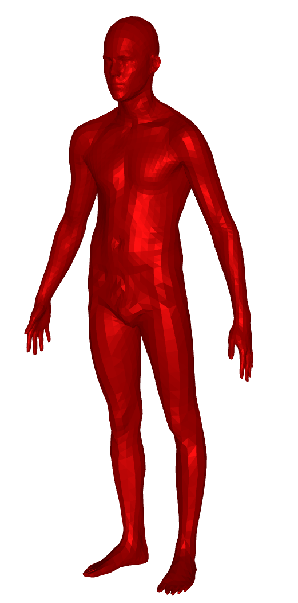
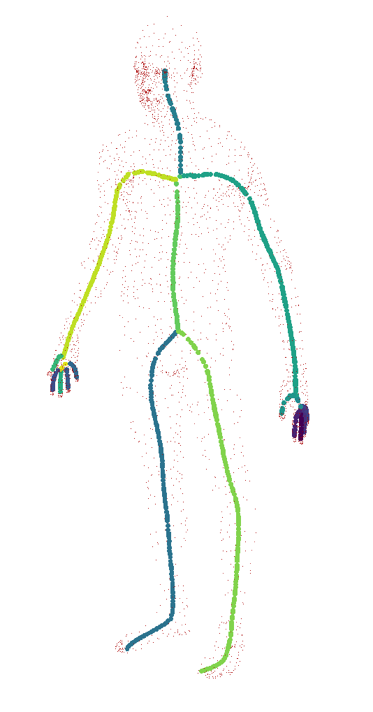
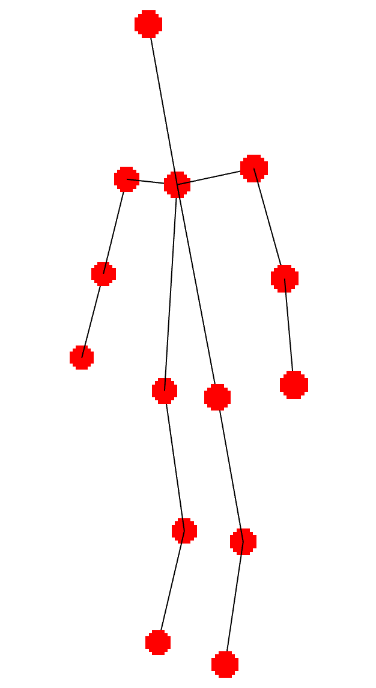
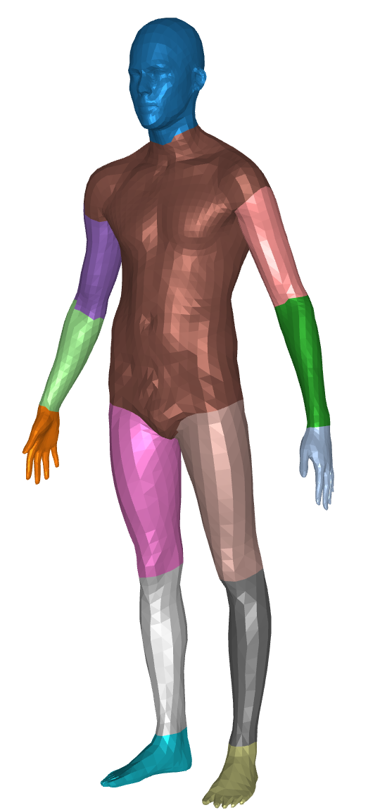

# Pipeline tesis

    
Extracción esqueleto

Malla original             |  Esqueleto extraido
:-------------------------:|:-------------------------:
|

    Logramos realizar la extracción utilizando el método implementado en CGAL.
  

    
Sampleo de articulaciones esqueleto

Esqueleto original         |  Articulaciones sampleadas
:-------------------------:|:-------------------------:
|

    Pienso samplear utilizando el método que ya implementé que tiene en cuenta la curvatura y el largo de cada curva.
  

    
Matching de vertices a articulaciones

Articulaciones sampleadas  |  Matching
:-------------------------:|:-------------------------:
|

    En primera instancia pienso simplemente utilizar los vértices más cercanos dentro de algún rango.
    Esto sin dudas que trae problemas (ejemplo hombro). Habrá que ver si son muy graves
  

    
Entrenamiento

    Ya lo pude hacer para una unica curva. Faltaría ver como hacer cuando tenemos multiples curvas.
    Posibles ideas son:
        - Agregar más parametros intrínsecos.
        - Agregar selectores de curvas.
  

    
Rendering

    Posiblemente el desafio más grande.
    Esta bueno que como primer intento alcanza con usar marching cubes como en la demo chiquita que hice.
    Es un problema que no esta resuelto a nivel de una única malla y nuestro desarrollo solo complica las cosas. Así que creo que quedará para otro trabajo optimizar y lograr renders pro que utilicen ray marching o cosas por el estilo.
  

# Instalación

    - sudo apt-get install libeigen3-dev
    - sudo apt-get install libcgal-dev

    - mkdir src/skeletonize/build
	- cd src/skeletonize/build && cmake ../
	- cmake --build .

# Correr

    - python src/preprocesspy path-to-off-file path-to-output [-a, -b, --std]
    - python src/training/train.py path-to-json-experiment cuda-device

# Parametros generacion:
    - Losses: [5e2, 1e2, 2e1, 150, 0, 7] ( parece que [1e3, 1e2, 2e0, 15, 0, 7] va un poco mejor )
    - Sphere tracing: t=0.08 g=0.004 r=2 (en armadillo t=0.04 anduvo mejor)
    - Point cloud: n=200000 r=5 t=0.09 g=0.01 (en armadillo t=0.04 anduvo mejor)
    - Marching cubes: l=0.003 (en armadillo l=0.007 anduvo mejor)