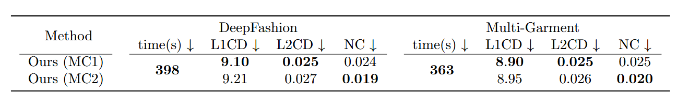

# DUDF: Differentiable Unsigned Distance Fields with Hyperbolic Scaling
Miguel Fainstein $^{\text{1},\text{2}}$, Viviana Siless $^{\text{1}}$, Emmanuel Iarussi $^{\text{1},\text{3}}$ 

$^{\text{1}}$ Universidad Torcuato Di Tella $^{\text{2}}$ FCEyN Universidad de Buenos Aires $^{\text{3}}$ CONICET

Repository for the CVPR 2024 [paper](https://lia-ditella.github.io/DUDF/).


## Citation

If you find our project useful, please cite the following

```     
@InProceedings{Fainstein_2024_CVPR,
    author    = {Fainstein, Miguel and Siless, Viviana and Iarussi, Emmanuel},
    title     = {DUDF: Differentiable Unsigned Distance Fields with Hyperbolic Scaling},
    booktitle = {Proceedings of the IEEE/CVF Conference on Computer Vision and Pattern Recognition (CVPR)},
    month     = {June},
    year      = {2024},
    pages     = {4484-4493}
}
```

## Install

The project requires a Linux machine and GPU(s) with CUDA 11.7
Other architectures are possible (eg. full CPU) but small changes in the code base might be necessary.

Code written in Python 3.10, main libraries used are *pytorch*, *numpy*, *pandas*, *open3d*, *trimesh*, *pytorch3d* and *matplotlib*.
For a quick installation run:

```
conda create -n dudf -f dudf.yml
conda activate dudf
```

If you want to utilize [MeshUDF](https://bguillard.github.io/meshudf/)'s marching cube method (mentioned in the paper as MC2), run the following:
```
cd src/marching_cubes
python setup.py build_ext --inplace
```

## Preprocessing
To preprocess a triangle mesh (or directory with triangle meshes), run
```
python preprocess.py input/mesh output/folder -s {NUMBER_OF_SAMPLES}
```

where NUMBER_OF_SAMPLES is the amount of surface points used for training. In our experiments we utilized 100k for simpler shapes and 200k for more complex shapes.

This generates two files, *mesh_file_t.obj* and *mesh_file_pc.ply*. The former is the original mesh transformed to fit the cube of side length 2, and the latter is the sampled point cloud.

## Training

For training, run
```
python train.py {PATH/CONFIG/FILE} {DEVICE}
```
An example configuration file can be found in *configs/train_cfg.json*. Parameter *device* is the number of the CUDA GPU to utilize. Training finishes by generating a 2D slice image of the level sets of the function and the gradient norm in the same slice; this was utilized during experimentation to analize the learned field. Also two marching cubes reconstructions are computed.

## Rendering

#### Sphere tracing
To render through means of sphere tracing algorithm, run
```
python generate_st.py {PATH/CONFIG/FILE}
```

An example configuration file can be found in *configs/st_cfg.json*. To render curvatures choose parameter *plot_curvatures* to be either *mean* or *gaussian*. Additionally, parameter *reflection_method* allows for two different illumination algorithms *ward* or *blinn-phong*.

#### Marching cubes

To render through means of gradient-based marching cubes algorithms, run
```
python generate_mc.py {PATH/CONFIG/FILE}
```

An example configuration file can be found in *configs/mc_cfg.json*. It is possible to select the version of the algorithm, either *cap*, *meshudf* or *both*; in reference to the methods described in papers [CAP-UDF](https://junshengzhou.github.io/CAP-UDF/) and [MeshUDF](https://bguillard.github.io/meshudf/).

#### Point cloud extraction

Lastly, we provide source code to perform point cloud extraction following the scheme laid in [NDF](https://virtualhumans.mpi-inf.mpg.de/ndf/). However, our method allows to not only extract a dense point cloud, but the normal field associated with it. Eventhough normal fields of open surfaces are not always orientable, we try to orient these utilizing library *Open3D*. If the original mesh was a closed surface, it can be reconstructed by means of *Poisson screening* (Kazhdan, 2013) method, which has much better results than the proposed *Ball Pivoting* approach. Simply, run

```
python generate_pc.py {PATH/CONFIG/FILE}
```

An example configuration file can be found in *configs/pc_cfg.json*.

## Example

As an example we can perform the full pipeline on the provided *beetle* mesh by running:
```
python preprocess.py data/beetle/beetle.obj data/beetle -s 100000
```
Then we can train a neural network:
```
python train.py configs/train_cfg.json 0
```
After training is over, in folder *results/beetle/experiment_1* we find all the files related with the process. Folder *reconstructions* will have two images:
1. *distance_fields.png* has information about the field and the gradient norm, with comparisons with ground truth values.
2. *pred_grad.png* has information about the gradient field plotted as a normal map.
Additionally, both marching cubes reconstructions will be available under the names *mc_mesh_best_CAP.obj* and *mc_mesh_best_MU.obj*. Again, here CAP(-UDF) and MU (MeshUDF) make reference to the papers where they were proposed.

After that we can perform sphere tracing reconstructions by running
```
python generate_st.py configs/st_cfg.json && python generate_st.py configs/st_mean_cfg.json
```
We can see the rendering with and without plotting mean curvatures.

Lastly, to extract the oriented point cloud run
```
python generate_pc.py configs/pc_cfg.json
```

## Update

We received some comments about the lack of code for pointcloud input, without the need of ground truth triangle meshes. So we added the necessary code.
To perform the preprocessing of the pointcloud, run 
```
python preprocess.py input/pointcloud output/folder -s {NUMBER_OF_SAMPLES} -pc
```

To train, just add the option to the config file. You can see 'configs/train_cfg_pc.json' as an example.
```
"onlyPCloud": true
```

We estimate ground truth distances, by computing shortest distance to the pointcloud. If the pointcloud is not dense enough, this approximation will be poor and the reconstruction will fail. In our experiments, pointclouds of as low as 20k points seemed to work well enough.

For completion, we rerun the experiments present on the paper with the same configuration but approximating ground truth distances as mentioned (only using pointclouds). The results are on the same level of those reported on the paper:



## Contact

For questions and comments contact Miguel Fainstein via mail

## License
MIT License

Copyright (c) 2024 Laboratorio de Inteligencia Artificial - UTDT

Permission is hereby granted, free of charge, to any person obtaining a copy
of this software and associated documentation files (the "Software"), to deal
in the Software without restriction, including without limitation the rights
to use, copy, modify, merge, publish, distribute, sublicense, and/or sell
copies of the Software, and to permit persons to whom the Software is
furnished to do so, subject to the following conditions:

The above copyright notice and this permission notice shall be included in all
copies or substantial portions of the Software.

THE SOFTWARE IS PROVIDED "AS IS", WITHOUT WARRANTY OF ANY KIND, EXPRESS OR
IMPLIED, INCLUDING BUT NOT LIMITED TO THE WARRANTIES OF MERCHANTABILITY,
FITNESS FOR A PARTICULAR PURPOSE AND NONINFRINGEMENT. IN NO EVENT SHALL THE
AUTHORS OR COPYRIGHT HOLDERS BE LIABLE FOR ANY CLAIM, DAMAGES OR OTHER
LIABILITY, WHETHER IN AN ACTION OF CONTRACT, TORT OR OTHERWISE, ARISING FROM,
OUT OF OR IN CONNECTION WITH THE SOFTWARE OR THE USE OR OTHER DEALINGS IN THE
SOFTWARE.
